# PUZZLE CAKE
### Your favourite recipes, always by Your side!
## Table of Contents
* [Launching the application](#launching-the-application)
* [Used Technologies](#used-technologies)
* [General Information](#general-information)
* [Screenshots of application](#screenshots-of-application)

## Launching the application
1. Clone this repository.
2. By using IDE, for example Intellij, open project and start backend service by using the command `mvn spring-boot:run`.
3. Then start frontend service, by using command `npm start`.
4. Remember to turn on database port (I use 3306 MySQL, if you want to change it, you have to change file `src/main/resources/application.properties`)

## Used Technologies
- Java 17
- Spring Boot (with Spring Security)
- React
- HTML5, CSS (with Media Query)
- MySQL database
- JavaScript

## Diagram ERD :
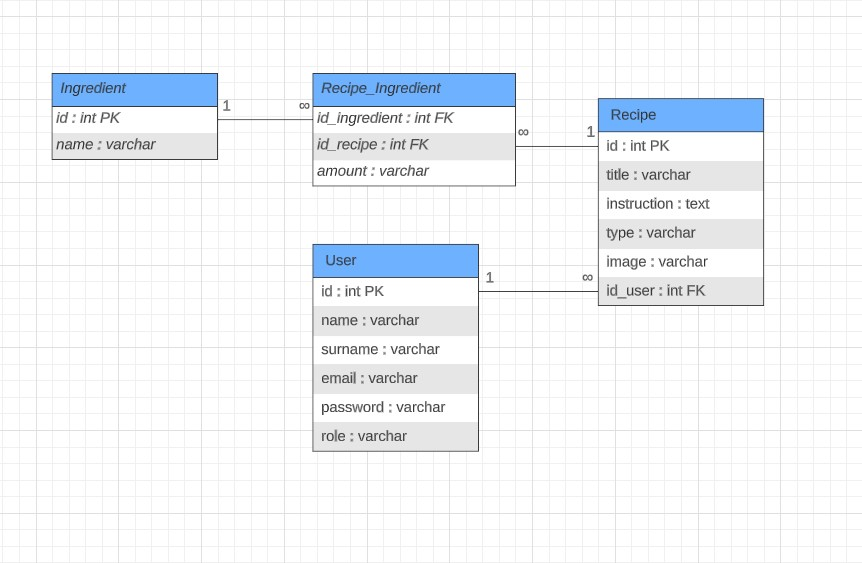

## General Information
##### PUZZLE CAKE is an app, that allows You to store Your and others' recipes. Below are features, which I implemented :
* [Register and login](#register-and-login)
* [List of recipes](#list-of-recipes)
* [Left searching bar](#left-searching-bar)
* [Add recipes](#add-recipes)
* [Navigation bar](#navigation-bar)
* [Personal information](#personal-information)
* [Logout button](#logout-button)
* [Statistics](#statistics)
* [Roles](#roles)

## Login page's features :
### Register and login
To create new account, You have to click button "Register" and then fill the form.
Then You can log in to Your account by using e-mail and password.

## "My book" page's features :

### List of recipes
At the center of the 'My Book' page, You can see all recipes.

### Left searching bar
You can use these buttons to search through recipes, taking under consideration type of the recipe.

### Add recipes
To add new recipe, You have to click on the button 'Add Recipe' and then fill the form and confirm it by clicking 'Save' button.

### Navigation bar
At the top of the page, You can swap between two pages : "My book" and "My Profile" by clicking on the corresponding buttons.

## "My profile" page's features :

### Personal information
In the left box, You can see information about Yourself, like name, surname and e-mail

### Logout button
In the left box, You can click on "Logout" button, which ends Your session and logouts from Your account.

### Statistics
In the right box, You can see Your account's statistics, like how many recipes You created and how many recipes You chose to be shown on Your "My book" page.

## Other implemented features :

### Roles
In app, You can be either "user" or "admin". Only admins can see "delete" button on "My profile" page, which delete user, which ID admin chose and all recipes assigned by that user.

# Screenshots of application
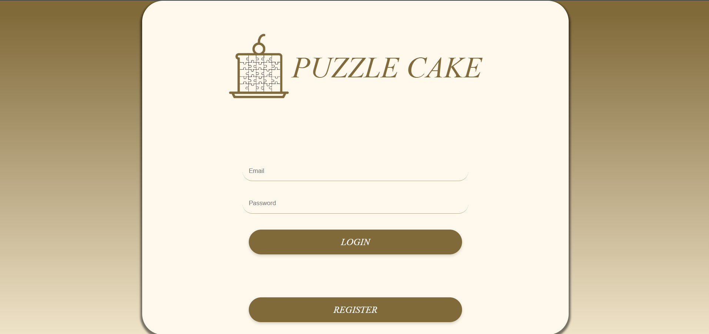
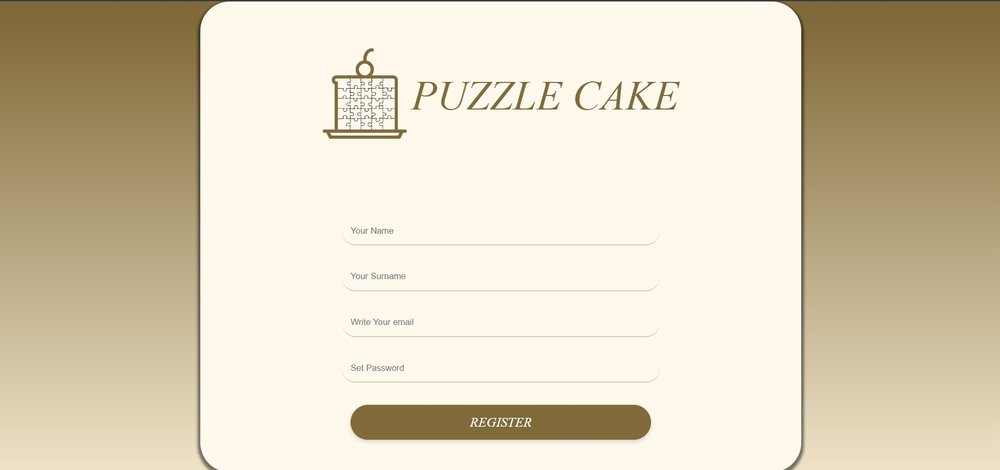
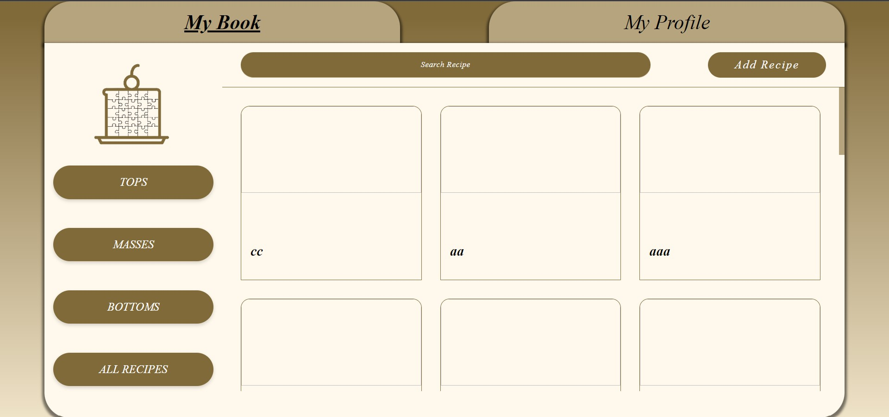
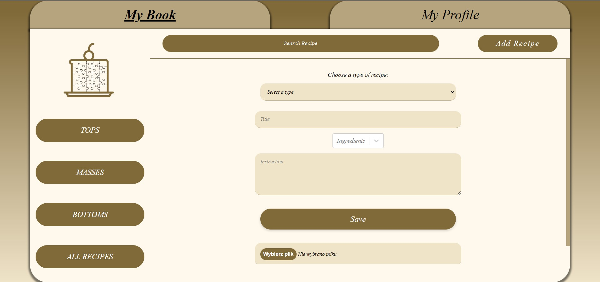
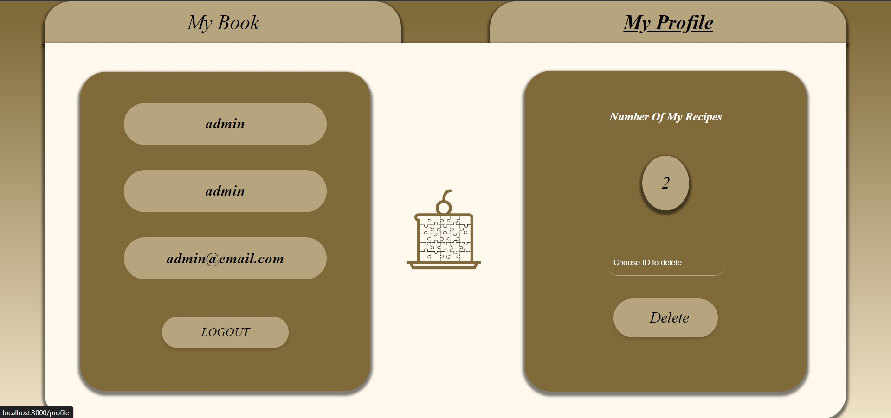

# Screenshots of Media Query

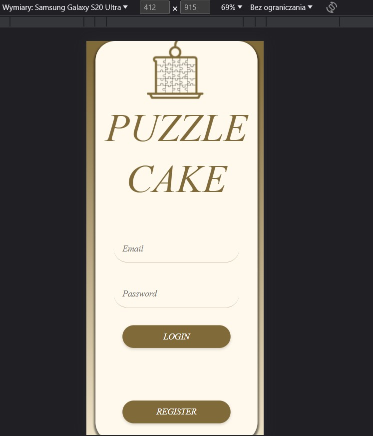
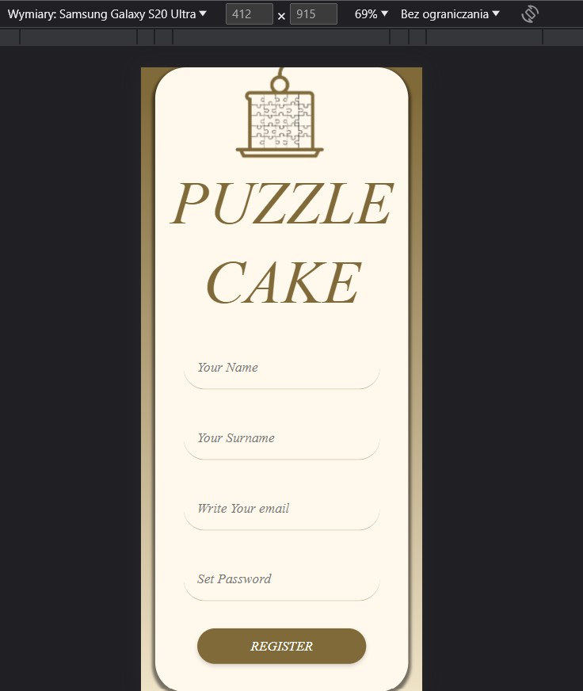
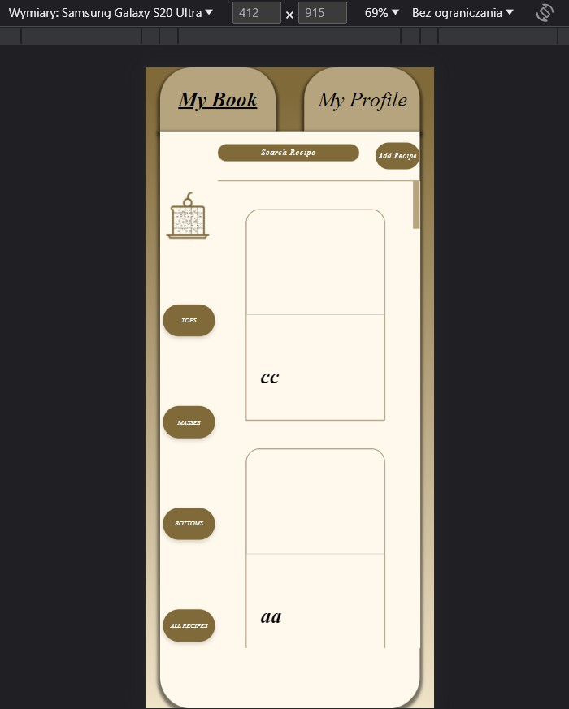
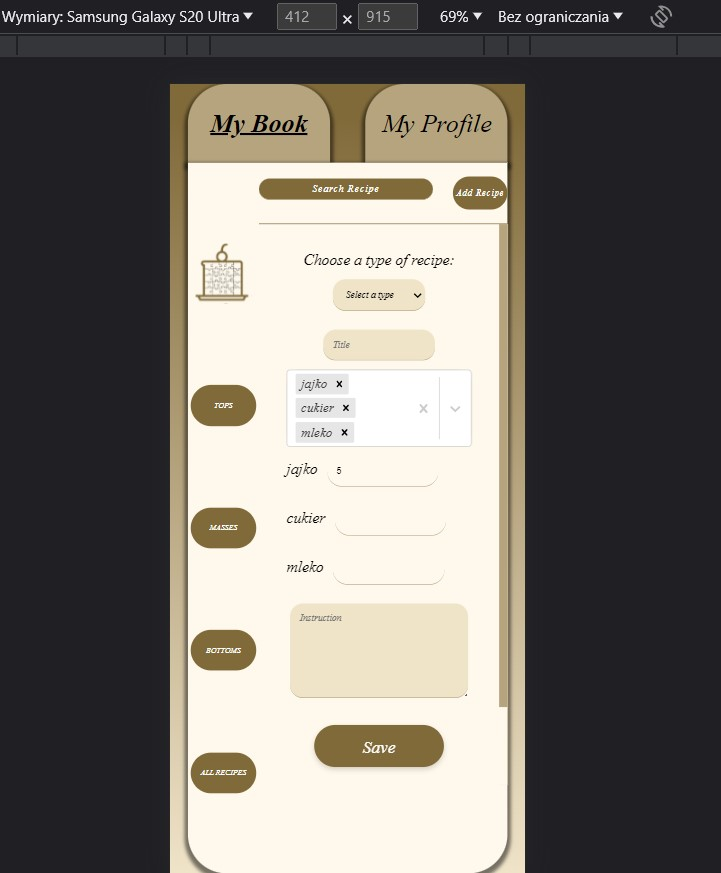
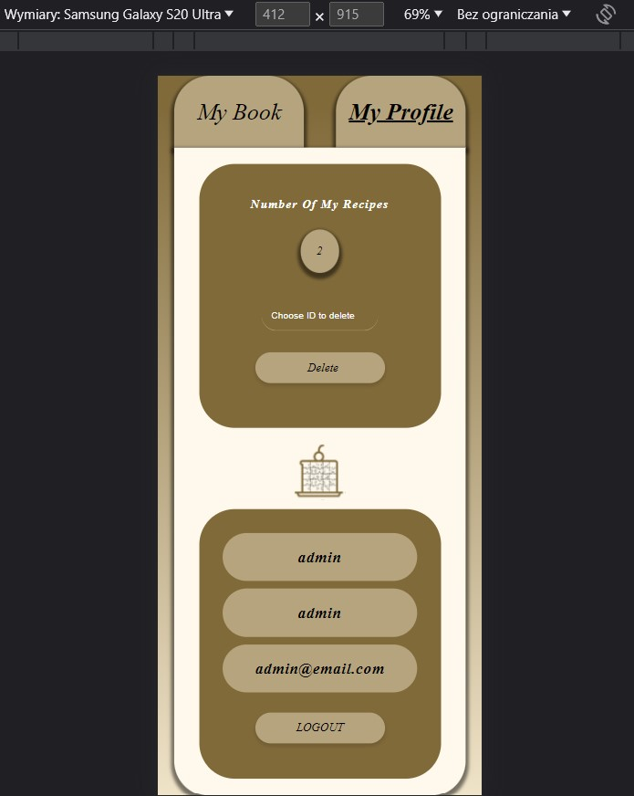

